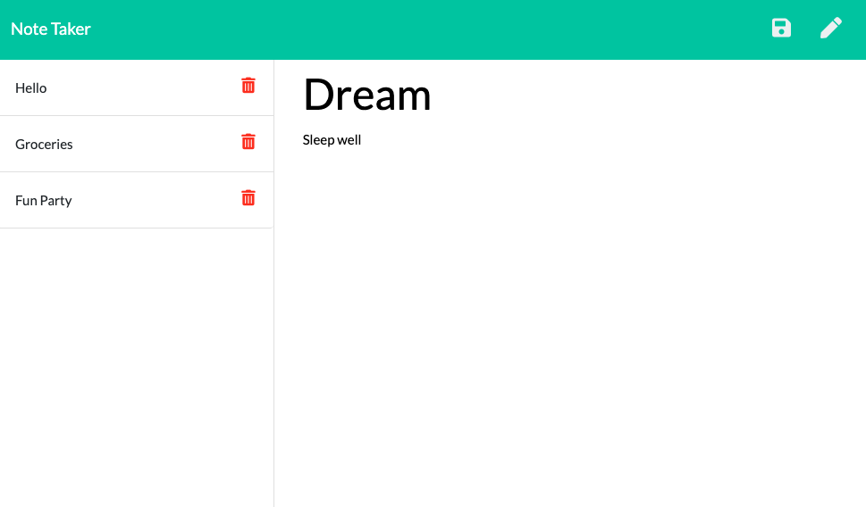

# Note Taker
> This application easily stores notes and reminders!

## Table of contents
* [General info](#general-info)
* [Screenshots](#screenshots)
* [Deployed URL](#deployedURL)
* [Licenses](#licenses)
* [Code](#code)
* [Setup](#setup)
* [Inspiration](#inspiration)
* [Contact](#contact)

## General info
The user can write and save notes and reminders. Enter a note title and a note body and hit save. 

## Screenshots

## Deployed URL
[Heroku Deployment](https://damp-bastion-26381.herokuapp.com)

## Setup
* run npm install
* run npm i uniqid

## Code
* HTML/CSS
* JavaScript
* Node.js
* Express.js

* Uniqid - allows for random ID generation for notes
* fs - writes files
* path - allows files to be directed to specific directories

## Licenses
* MIT license
* ISC

## Inspiration
UCLA week 11 Challenge. 

## Contact
Back end functionality created by Alex Chigas. Front end was cmopleted. 
